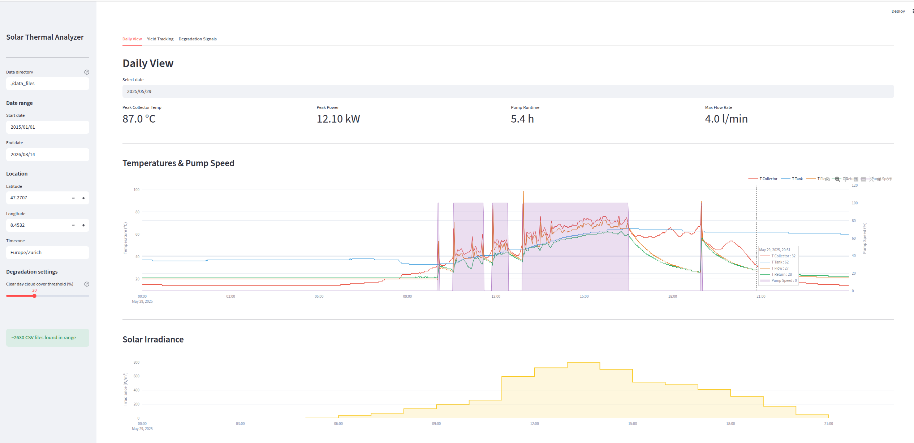
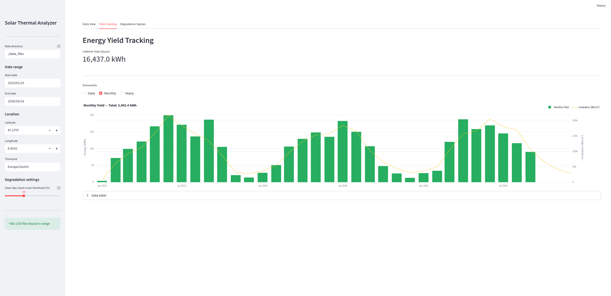
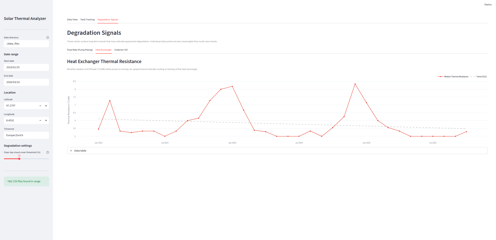

# Solar Thermal Analyzer

A local Streamlit dashboard for visualizing and analyzing historical data from a **Steca TR A503 TTR** solar thermal controller.

## Screenshots

**Daily View** — temperature curves, pump activity, solar irradiance overlay


**Yield Tracking** — monthly energy yield with irradiance correlation


**Degradation Signals** — heat exchanger thermal resistance trend


## Features

- **Daily View** — Temperature curves, pump speed, power output, and flow rate for any selected day
- **Yield Tracking** — Daily / monthly / yearly energy yield (kWh) with lifetime totals
- **Degradation Signals** — Three long-term indicators:
  - Flow rate trend (pump/piping blockage)
  - Heat exchanger thermal resistance (scaling/fouling)
  - Collector year-over-year performance on clear days (soiling/degradation)

## Architecture

10 years of 1-minute data (~5.26 M rows, ~840 MB) never loads fully into RAM. **DuckDB** reads CSV files directly via glob patterns and returns only small aggregated DataFrames to Plotly. Single-day views (1,440 rows) use pandas directly.

| Use case | Method |
|----------|--------|
| Daily view (1 day) | pandas direct CSV load |
| Yield aggregations | DuckDB GROUP BY → pandas |
| Degradation metrics | DuckDB GROUP BY → pandas |
| Weather data | Open-Meteo API → pandas |

## Setup

```bash
pip install -r requirements.txt
```

## Data layout

Place CSV files exported from the Steca controller in the directory configured in `config.toml` (default: `./data_files`). The expected structure matches the Steca SD card export:

```
data_files/
└── YYYY/
    └── MM/
        └── YYYYMMDD.csv
```

A flat layout (`data_files/YYYYMMDD.csv`) is also supported as a fallback.

## Configuration

Edit `config.toml` before first run:

```toml
[data]
directory = "./data_files"   # path to CSV root

[location]
latitude  = 48.14            # your coordinates (for weather API)
longitude = 11.58
timezone  = "Europe/Berlin"

[app]
clear_day_cloud_cover_max = 20   # % cloud cover threshold for "clear day"
```

## Run

```bash
streamlit run app.py
```

## CSV Format

The Steca TR A503 TTR exports one CSV per day with 1-minute intervals:

| CSV Column | Internal Name | Notes |
|------------|---------------|-------|
| `DATE & TIME` | `timestamp` | Index |
| `T1[C]` | `T_collector` | Collector temperature |
| `T2[C]` | `T_tank` | Tank temperature |
| `T4[C]` | `T_flow` | Flow temperature |
| `T5[C]` | `T_return` | Return temperature |
| `V'[l/min]` | `flow_rate` | |
| `P[kW]` | `power_kw` | Comma-decimal in quoted field |
| `Qday[kWh]` | `Qday` | Cumulative intraday counter, resets at midnight |
| `Qsum[kWh]` | `Qsum` | Lifetime counter |
| `R1 PWM[%]` | `pump_speed` | Continuous PWM signal (0–100%) |

`Err` values (sensor faults) are treated as `NULL`. The European comma decimal separator (`"1,6"` → `1.6`) is handled automatically by both DuckDB and pandas.
